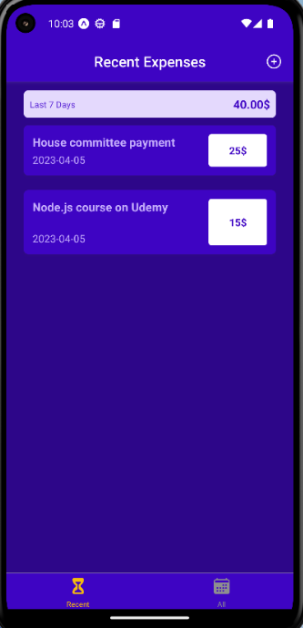

# Expense-Tracker
This is a mobile app built with React Native that helps users track their expenses. Users can add their expenses, categorize them, and see a summary of their spending habits.



## Technologies

👉 REACT Native

👉 Expo cli

👉 Firebase

## Implementation Remarks

1️⃣ I have added to the project 3 main components that will help me perform the task in a simpler:
1. AllExpenses - Contains all the expenses you added.
2. ManageExpense - A screen where you can manage a specific expense that has been added and perform actions such as editing and deleting.
3. RecentExpense - Contains all the recent expenses from last 7 days you added.

2️⃣ I used the react Context API in order to manage all the global state on the client side.

3️⃣ I implemented Restful services using the baas called firebase.

## Usage

```
~$: npm i
~$: npm start
```

🔹 To execute in Andriod studio environemt:

```
~$: a
```
🔹 To execute in web-browser:
```
~$: w
```

🔹 To execute in web-browser: 

Scan the qr code in Expo Go app.

## for any questions

```
if(haveAnyQuestions === true){
    let yourName = ".......", question = ".......";
    sendEmailToMe(yourName,question,odedatias8115@gmail.com);
}
```
